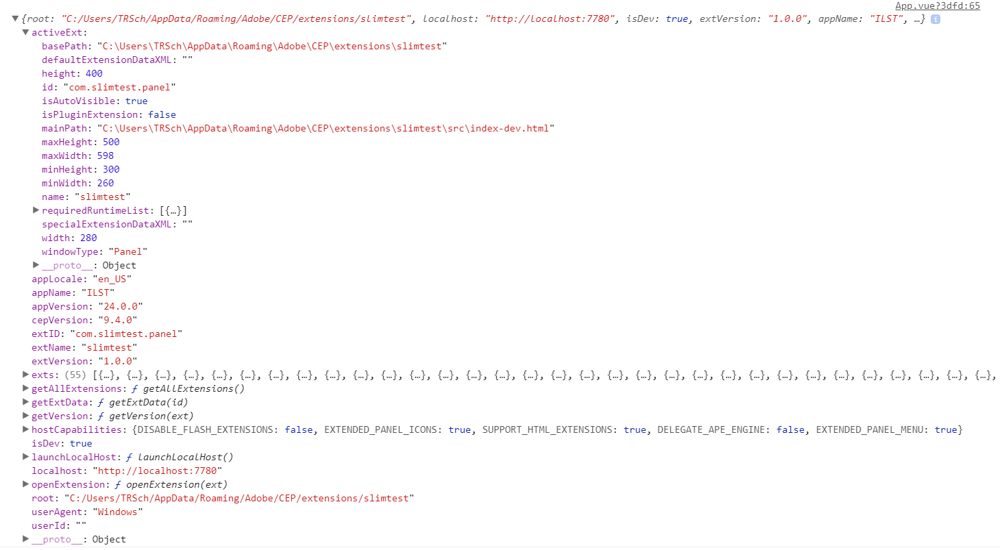
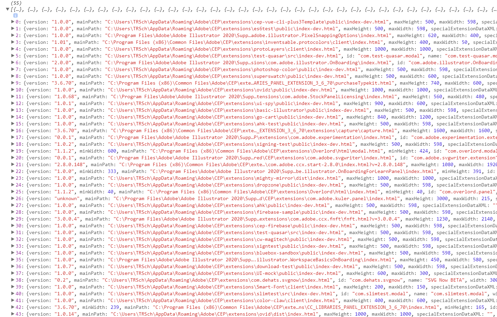

# cep-spy

Slim, no-dependency utility to dynamically reveal all information about current Adobe host application, active panel using it and even it's sibling CEP extensions, all without needing CSInterface.

## Installation

```bash
npm install cep-spy
```

## Usage

```js
// Via import:
import spy from "cep-spy";

// Via require:
const spy = require("cep-spy").default;
```

## Examples:

### CEP-Spy returns as an object with various pre-calculated values and helper functions:

```js
import spy from "cep-spy";
console.log(spy);
```



Some are simple wrappers around CSInterface's functions but returning more useful formats (no need to always `JSON.parse`), some return values that CSInterface doesn't even offer but are useful (localhost port, extension version, environment, etc)

---

### Launch the current localhost of the panel without knowing the app, panel, or localhost:

```js
import spy from "cep-spy";

spy.launchLocalhost(); // Launches in default browser

console.log(spy.localhost); // Returns `http://localhost:####`
```

---

### Easily get absolute values about your panel/environment regardless of OS:

```js
const spy = require("cep-spy").default;

console.log(spy.path.root); // Returns 'C:/Users/.../[your-panel-root]'
console.log(spy.extVersion); // Returns '1.0.0', as defined in manifest.xml
console.log(spy.isDev); // Returns BOOL true if bombino and while hot reloading
console.log(spy.appName); // Returns 'ILST' or current <HostList> param of host app
```

---

### Spy on all your colleagues:

```js
import spy from "cep-spy";

let siblings = spy.getAllExtensions();
console.log(siblings);
```



---

## API

### Static values

- `path.root` [STRING]: The absolute path (pre-treated) of the current extension
- `path.userData` [STRING]: The absolute path (pre-treated) to CS's `userData`
- `path.commonFiles` [STRING]: The absolute path (pre-treated) to CS's `commonFiles`
- `path.myDocuments` [STRING]: The absolute path (pre-treated) to CS's `myDocuments`
- `path.hostApplication` [STRING]: The absolute path (pre-treated) to the app's `hostApplication` executable
- `package` [OBJECT]: The JSON-parsed contents of the panel's root `package.json` file
- `extID` [STRING]: `id` of the current extension as seen in manifest.xml (eg `com.adobe.panel`)
- `author` [STRING/OBJECT]: Returns the `author` parameter of `package.json`, either as a string or an Object with `name`, `email`, and `url` key-values.
- `extName` [STRING]: Proper name as displayed in Menu of the current extension
- `extVersion` [STRING]: The major, minor, micro versioning of the extension (eg `1.x.x`) in manifest.xml
- `ext` [OBJECT]: Object containing CSInterface data for current extension (height, mainPath, width, windowType, etc.)
- `localhost` [STRING]: The direct URL including `"https://localhost:"` of the current extension
- `isDev` [BOOL]: True if extension"s `document.location` contains `"localhost"` (if bombino panel during hot reload for development)
- `appName` [STRING]: The 4-letter app identifier from `<HostList>` (eg `"ILST"`, `"AEFT"`)
- `appLocale` [STRING]: The language/region locale identifier (eg `"en_US"`)
- `appVersion` [STRING]: The major/minor/micro of the host app (eg `24.0.0`)
- `userAgent` [STRING]: If OS is `Windows` or `Mac`
- `cepVersion` [STRING]: The major/minor/micro of CEP engine
- `hostCapabilities` [OBJECT]: The extended parameters for host under the same name in CSInterface
- `userId` [STRING]: `CSInterface.getCurrentImsUserId()` wrapper (returns null often)
- `exts` [ARRAY]: Array of all CEP extensions (as objects with base data) in current host app.

### Functions

- `getAllExtensions()`: Returns array of all extension data including version from each manifest.xml
- `getExtData(id)`: Returns extension data object of matching `id`
- `openExtension(ext)`: Requests a given extension launch by extension data object
- `getVersion(ext)`: Returns a major/minor/micro from given extension data object
- `launchLocalhost()`: Launches any given localhost or the current extension's localhost if none
- `launchHomepage()`: Launches the homepage given in `package.json`'s `homepage` attribute
- `launchGitRepo()`: Launches the GitHub repo link given in `package.json`'s `repository` attribute
